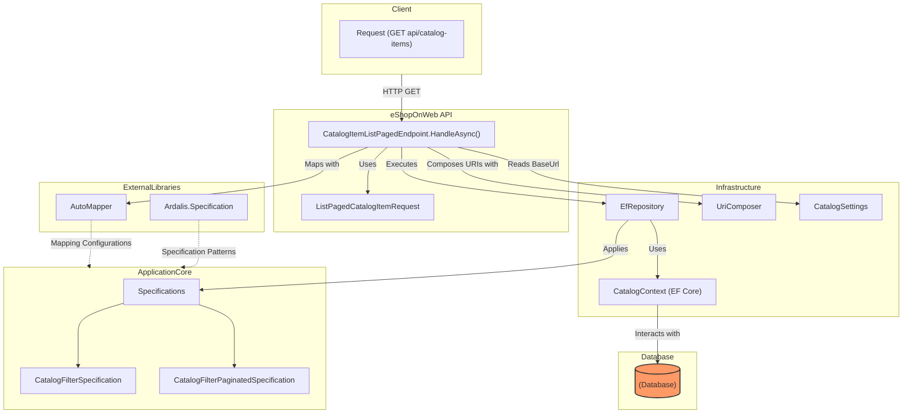

# Iterative Prompting

!!!warning Warning
The screenshots provided in this guide are based on an older version of the AskTheCode plugin. The actual response from the plugin might differ (and hopefully be better) in the latest versions.
!!!

In this guide, we'll showcase the power of specifying steps for the AskTheCode plugin. By providing a structured prompt, you can guide the plugin to analyze code in a more focused manner, ensuring you get the insights you need.

Full demo can be found here:
[Endpoint Handling Flow Analysis](https://chat.openai.com/share/f28333ee-f689-4f9c-8564-5d4147a7ae7e)

## Prerequisites

- Access to the eShopOnWeb repository: [https://github.com/dotnet-architecture/eShopOnWeb](https://github.com/dotnet-architecture/eShopOnWeb)
- AskTheCode plugin installed

## Step 1: Crafting the Prompt for AskTheCode Plugin

The first step is to provide a clear and structured prompt to the AskTheCode plugin. This prompt acts as a set of instructions, guiding the plugin on what to analyze and how.

**Input the following prompt:**  

```prompt
You are a technical documentation writer for the eShopOnWeb repository. Your task is to provide a clear and detailed description of the full handling flow for the endpoint 'GET api/catalog-items' in the given GitHub repository: 
https://github.com/dotnet-architecture/eShopOnWeb

Follow these steps:

1. Locate the file that handles the specified endpoint in the repository. Make sure that it is the correct file and it indeed contains the logic for the endpoint handling.
2. Analyze the code of the handler to understand its functionality.
3. Fetch the code of all dependencies related to the route handler and data retrieval logic.
4. Analyze the dependencies, including their code and further dependencies if needed.
5. Describe the main components involved in handling the 'GET api/catalog-items' endpoint and explain their interaction.

Ensure your description includes any abstract classes or interface implementations as well as explanations of any external library usage. 
Make sure to provide a structured and easy-to-understand response that demonstrates a deep understanding of the codebase.
```

## Step 2: Plugin's Search for the Route Handler

Upon receiving the prompt, AskTheCode will begin its search for the file handling the 'GET api/catalog-items' route.


## Step 3: Plugin Identifying Dependencies

Now we need to ask the plugin to proceed with the depndencies analysis.

**Input the following prompt:**

```prompt
Please continue with the dependencies analysis
```


## Step 4-6: Re-iterating with Dependency Analysis

Now we can ask the plugin to proceed with the dependency analysis over and over until we are satisfied with the results. To keep the knowledge gained in context and prevent losing it, we ask ChatGPT to summarize all the knowledge gained first and only then proceed with further research.

**Input the following prompt:**

```prompt
Please summarize what you've learned so far and then continue with the dependencies analysis
```

This process can be repeated as many times as needed (3 times in this demo).


## Step 5: Reviewing the Plugin's Response

Once the analysis is complete, AskTheCode will provide a comprehensive description of the main components, their interactions, and any other relevant details as instructed in the prompt.

## Visualizing the Analysis: Mermaid Flowchart

To further enhance our understanding of the 'GET api/catalog-items' endpoint and its dependencies, we can visualize the results using a Mermaid flowchart. This provides a graphical representation of the interactions and flow of the endpoint, making it easier to grasp the overall structure and logic.

By prompting ChatGPT with the following:

```prompt
Please build a detailed mermaid flowchart diagram based on this research. Group related entities into subgraphs, use cylindrical shaped nodes only for the database
```

We can obtain a Mermaid diagram similar to the following:



## Conclusion

By providing a clear and structured prompt to the AskTheCode plugin, you can harness its power to get precise insights into specific parts of a codebase. This approach can be replicated for other endpoints or repositories, demonstrating the flexibility and capability of the plugin.


